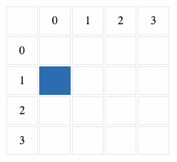

# Table Walker

## The Task
The task is to accept a set of commands and then simulate whether an object can move according to these commands without falling of the table it sits on. 

The object always occupies exactly one cell and can be seen as a point without mass. Origo is at the top left (0,0).

## The Solution
The current solution is comprised of two steps, first you initiate a simulation by setting the width & height of the board, and then you enter the initial position of the object: 

```javascript
new Simulation(width, height, x, y)
```

Then by using `simulate()`, you can simulate different commands: 

* `0`: Quit the simulation and return the final position of the piece
* `1`: Move one step forward
* `2`: Move one step backwards
* `3`: Rotate clockwise 90 degrees
* `4`: Rotate anti-clockwise 90 degrees

An example of running a simulation, 

```javascript
const boardA = new Simulation(4, 4, 2, 2);
boardA.simulate(1, 4, 1, 3, 2, 3, 2, 4, 1, 0); // [0, 1]
```



*NB: In order to keep the code clean, the graphical solution is not part of the code commited to the repo.*

## The tricky bits

### Extending the shape of the board
The current implementation requires that the width and height of a rectangular board is passed to the constructor of the simulation instance. I would consider this poor code quality, since now you have limited the implementation to require a rectangular board. 

A better solution would be to have the constructor accept an argument of the type `Shape`, and then create board shapes that implement an interface `Shape`. However, such a solution would require a way to map out the board area, so it would be possible to verify whether the game piece is on the board or not. 

### Adding more commands
Adding more commands to the simulation is easily done by adding new cases to the switch. The board and game piece are decoupled, which is great when you want to extend the functionality. 

If you would like to add a command to rotate the table instead of the object, then we would need to add an understanding of direction on the board class as well. 

Alternatively, one could get the same outcome by adding a command to Board, rotate(), which would rotate the game piece in the opposite direction. (Rotating the board 90 degrees counterclockwise is the same as rotating the game piece 90 degrees clockwise). 

However, it all comes down to what the final product should be, are we talking about a graphical output, or is it just a CLI where only the final result is relavant. Different problems have different solutions.

### Change of protocol
In JavaScript it would be extremely easy to accept an object instead of using the "active record pattern"-like implementation. We would pass on the object (after decoding it if it is in the form of a JSON string), and could accept named parameters as the argument instead, which could be destructured. 

Personally I think named parameters have a lot of positive aspects, such as making it easier to understand what a parameter is since you get more descriptive names, and they work well with parameters that are optional.

## The solution with Java
The main two differences that I come to think about if you were to build this solution with Java instead would be: 

### Data structures
In Java you would have access to data structures that are not included by default in JavaScript. 

When it comes to keeping track of orientation, where you are able to spin around in circles, it would be a lot cleaner to implement a solution using a deque. This would clean up the rotate() implementation, since you no longer would need to manually handle the edge cases. 

### Interfaces
As previously discussed, the handling of the board shape would be great to implement   in a different way, and as mentioned above, using an interface for this would be a great way to go about it. See section above for more information about this. 
